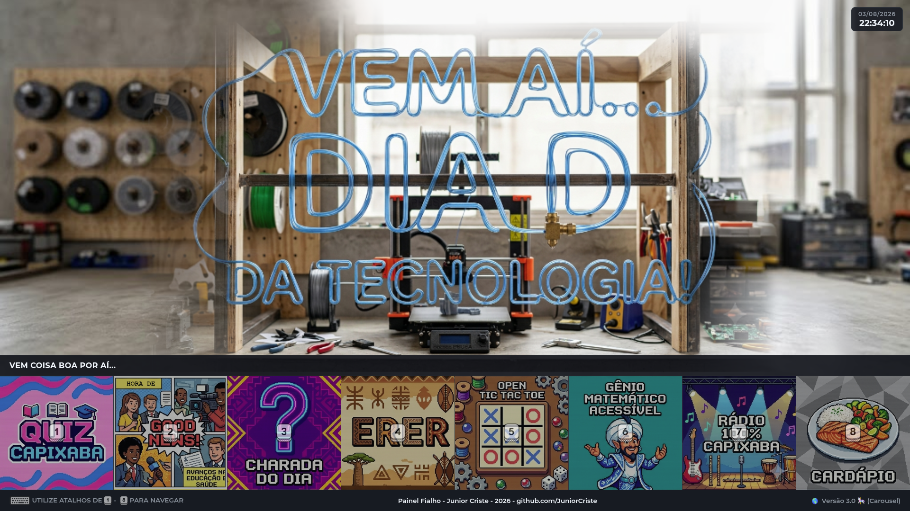
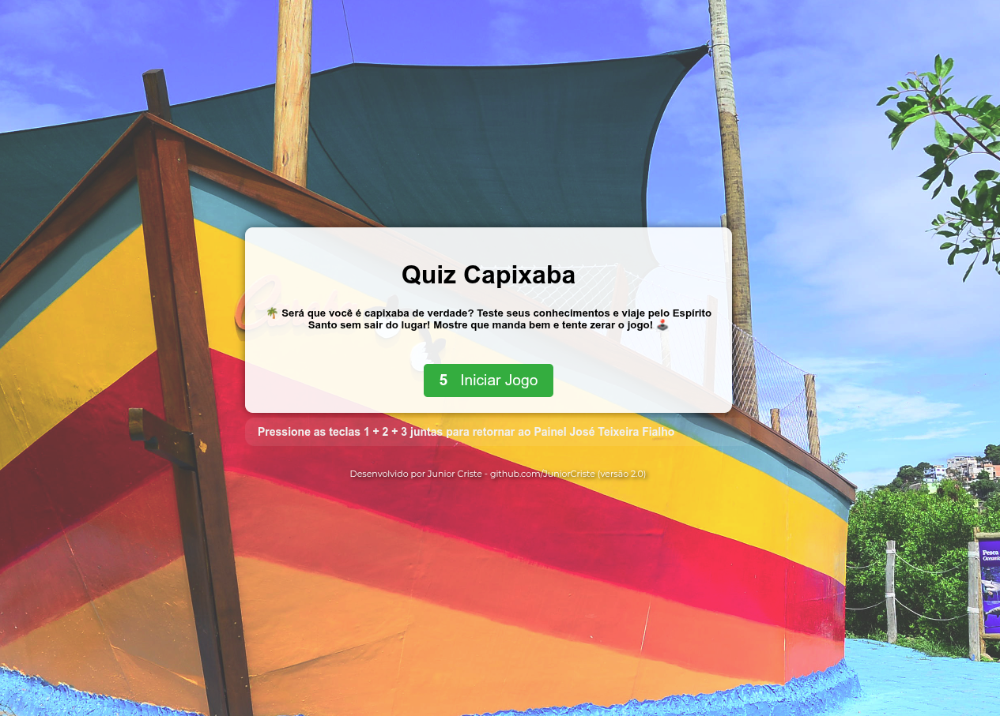
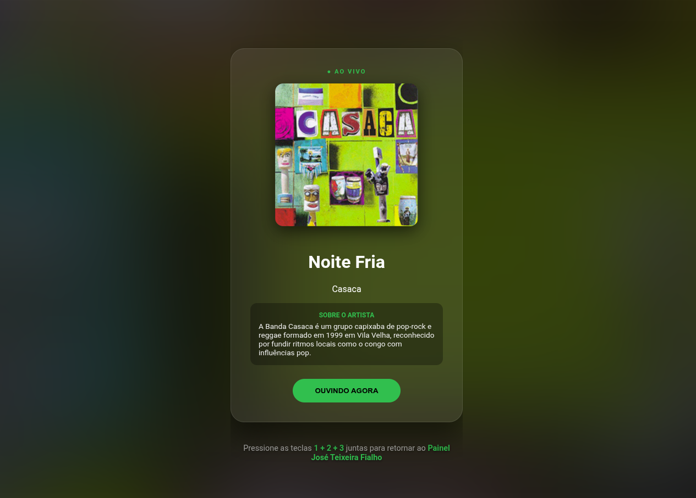

# 📱 Painel Interativo Fialho

> Um Painel educacional interativo projetado para enriquecer o ambiente escolar através de gamificação, cultura regional e recursos digitais acessíveis.

---

## 🔗 Link de Acesso
Acesse o projeto: [https://juniorcriste.github.io/Painel-Interativo/](https://juniorcriste.github.io/Painel-Interativo/)

---

## 📝 Sobre o Projeto

O **Painel Interativo Fialho** é uma plataforma centralizada desenvolvida para escolas da rede estadual do Espírito Santo, e exposta na **EEEFM José Teixeira Fialho**. O objetivo principal é transformar a experiência digital dos alunos e da comunidade escolar, oferecendo acesso rápido a conteúdos educativos, aplicativos e jogos interativos que estimulam o aprendizado de forma lúdica e tecnológica.

O painel serve como uma ponte entre a tecnologia e a sala de aula, integrando ferramentas de gamificação com o currículo escolar e a valorização da identidade local.

### Principais Funcionalidades:

* **Gamificação Educativa:** Jogos como *Quiz Capixaba*, *Gênio Matemático* e *Tic Tac Toe* para reforçar o conhecimento de forma divertida.
* **Cultura Regional:** Espaço dedicado à valorização da cultura do Espírito Santo, incluindo a *Rádio 100% Capixaba*.
* **Divulgação de Serviços:** Slides divulgando ações escolares,do conselho de escola, agenda e mais coisas relevantes.
* **Informativos Dinâmicos:** Seções de notícias positivas (*Good News!*), desafios diários (*Charada do Dia*) e o cardápio escolar.

---

## 📸 Demonstração

Aqui estão algumas capturas de tela do painel em funcionamento:

### Menu do Painel Interativo com Aplicativos, Jogos e Informativos

### Quiz Capixaba, um dos jogos disponíveis

### Jogo Gênio Matemático

### Rádio Capixaba com artistas locais

---

## 🛠️ Tecnologias Utilizadas

Para a construção deste painel, foram utilizadas tecnologias web modernas com foco em performance e responsividade:

* **HTML5:** Estruturação semântica do conteúdo.
* **CSS3:** Estilização avançada, utilizando conceitos de design moderno e interface intuitiva.
* **JavaScript:** Lógica de interatividade e navegação do painel.
* **GitHub Pages:** Hospedagem padrão e eficiente para o projeto.
* **IA:** Gemini para base do projeto.
* **Repositórios:** Outros Repositórios próprios para integração dos aplicativos e jogos.

---

## 🎨 Design e Identidade

O projeto segue uma identidade visual limpa e organizada, com ícones personalizados para cada módulo, facilitando a usabilidade para alunos de todas as idades (desde o Ensino Fundamental até o Médio).

---

## 🚀 Como contribuir

1. Faça um **Fork** do projeto.
2. Crie uma nova **Branch** com sua modificação: `git checkout -b minha-melhoria`
3. Salve suas alterações e faça o **Commit**: `git commit -m 'Adicionando nova funcionalidade'`
4. Envie sua Branch: `git push origin minha-melhoria`
5. Abra um **Pull Request**.

---

## 👨‍💻 Autor

Desenvolvido por **Junior Criste**.  
 

